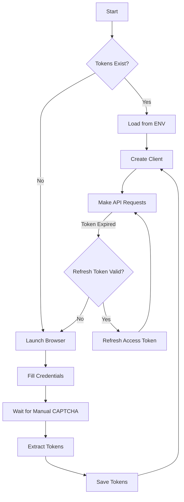

# Codementor API

A Python client for accessing Codementor's internal API. Use it to get data about new jobs, previous jobs and sessions, and reviews.

## Quickstart Guide

### Installation

Currently the project is built to be used with python `poetry`. I may setup for `pip` in a future version.

```bash
poetry add git+https://github.com/zackplauche/codementorapi.git
```

### Instantiating the client

First, instantiate a client passing in an `access_token` and `refresh_token` from your Codementor cookies in your browser.

```python
import codementorapi

client = codementorapi.Client(
    access_token='<your access token>',
    refresh_token='<your refresh token>',
)
```

There's also a built-in method to get the tokens from your browser. It uses playwright to open a new browser window and log in. You may need to manually solve a captcha.

```python
access_token, refresh_token = codementorapi.get_auth_tokens(
    username='<your username>', 
    password='<your password>'
)
```

Once you have our auth tokens you can also optionally add them to a `.env` file to use the convenient `from_env` class method.

```python
client = codementorapi.Client.from_env()
```

After that, you're free to use the API.

### Jobs

Get the latest available jobs from the platform. This returns the 15 newest jobs.

```python
jobs = client.get_jobs()
```

Get all available jobs from the platform.

```python
all_jobs = client.get_jobs(all=True)
```

You can also only get the related jobs for your profile.

```python
related_jobs = client.get_related_jobs(related=True)  # 15 newest
all_related_jobs = client.get_related_jobs(related=True, all=True)
```

Once you have the job list, you can get the deatils for the specific job.

```python
job_details = client.get_job_details(job_random_key=jobs[0].random_key)
```

### Applying to Jobs

There are two options to apply to a job. You may choose to do both!

First, you can send job interest.
```python
client.send_job_interest(
    job_random_key=job['random_key'], 
    message='Hello!', 
    open_to_special_rate=True
)
```

Second, you can message the mentee directly.

```python
username = job['user']['username']
first_name = job['user']['name'].split(' ')[0]

client.send_message(username, f'Hey {first_name}! Would you like to have a call?')
```

# Get sessions

```python
sessions = client.get_sessions()
session_details = client.get_session_details(sessions[0].id)
reviews = client.get_reviews()
freelance_jobs = client.get_freelance_jobs()
```

## How it works

